# Ecommerce Admin & User Apps (Flutter, Firebase)

A two-part Flutter e-commerce system built on a shared Firebase backend:

- **Admin App (current focus)**: Manage products, categories, brands, stock, purchase history, and product images.
- **User App (planned)**: Browse products, view details, manage cart, and place orders using the same backend.

This repository currently focuses on the **Admin App** implementation and prepares the foundation for the upcoming **User App**.

---

## Screenshots

Add your screenshots in: `assets/screenshots/`  
Recommended naming: `01.jpg` to `16.jpg`

<div align="center">
  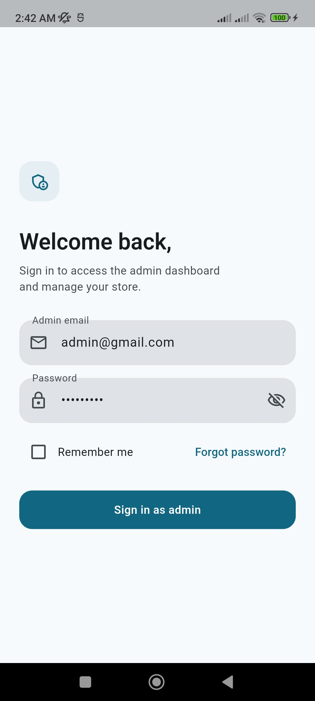
  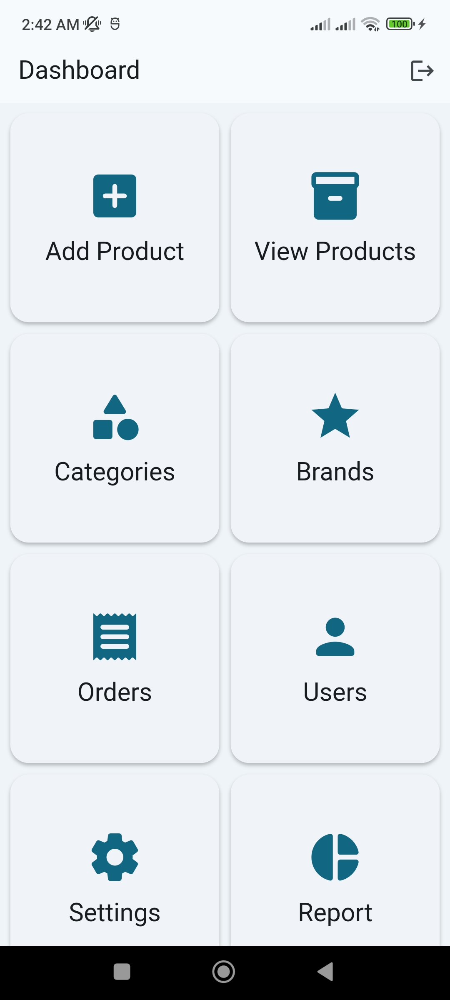
</div>

<br>

<div align="center">
  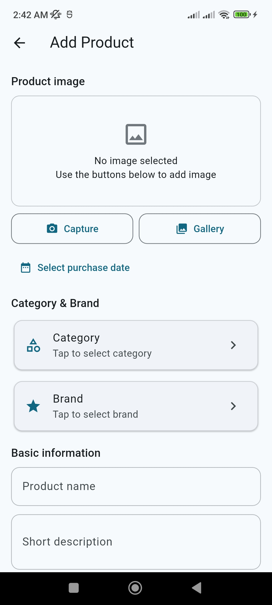
  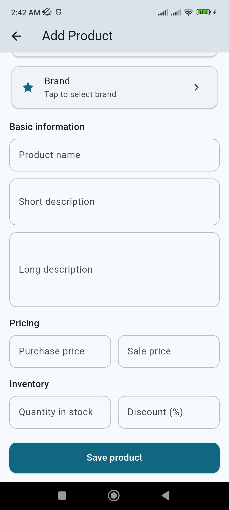
</div>

<br>

<div align="center">
  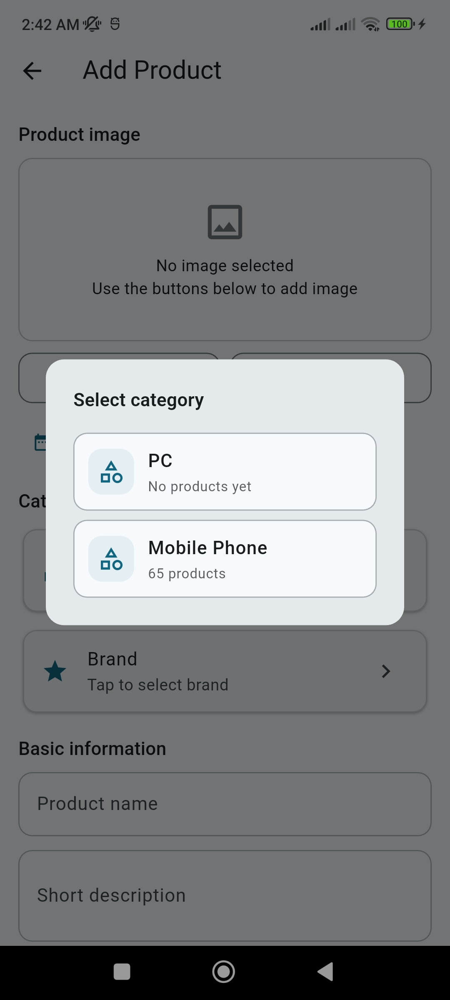
  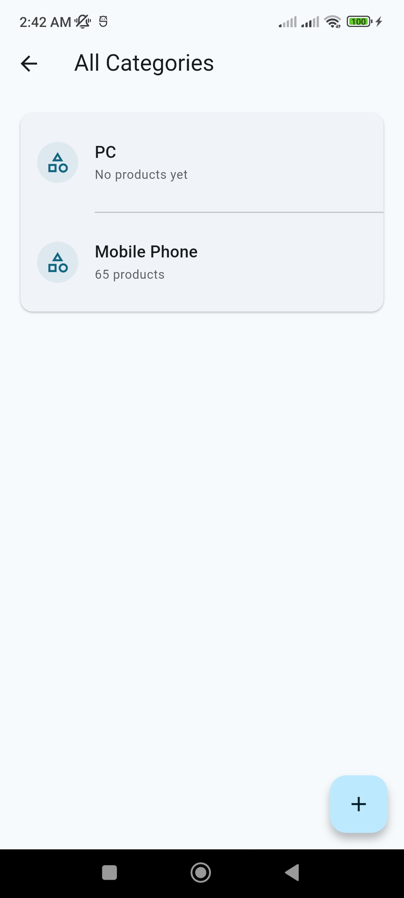
</div>

<br>

<div align="center">
  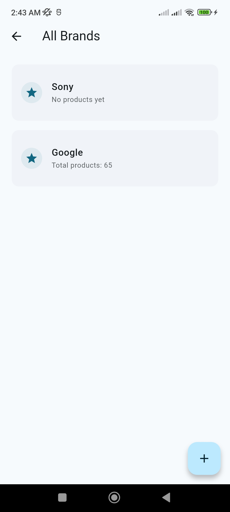
  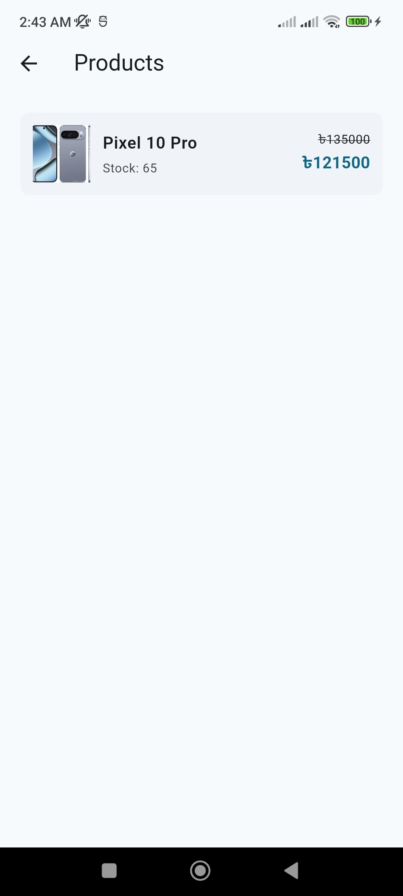
</div>

<br>

<div align="center">
  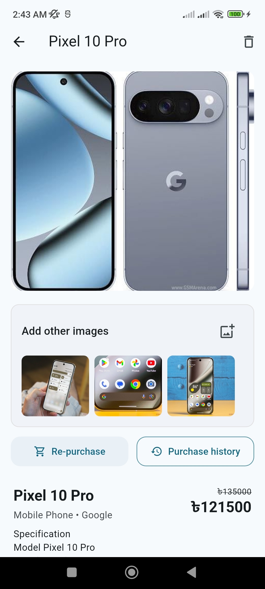
  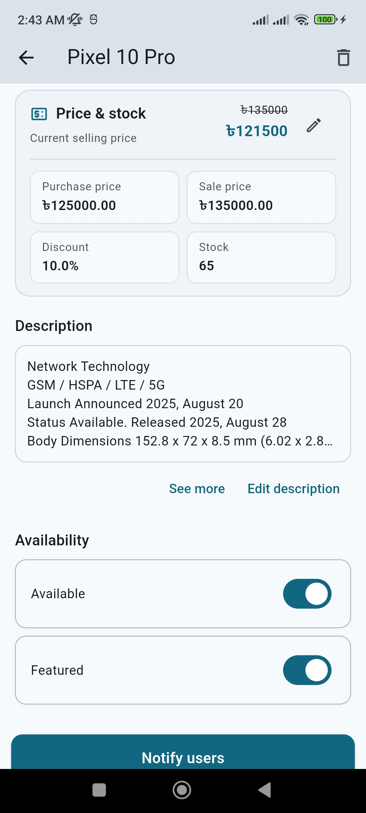
</div>

<br>

<div align="center">
  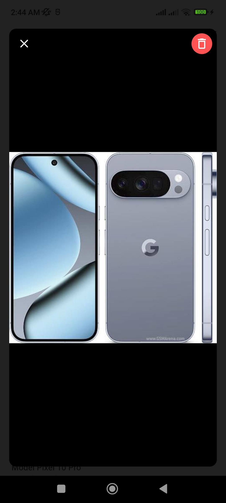
  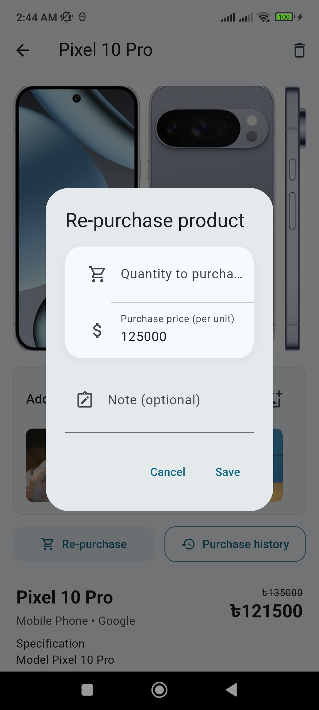
</div>

<br>

<div align="center">
  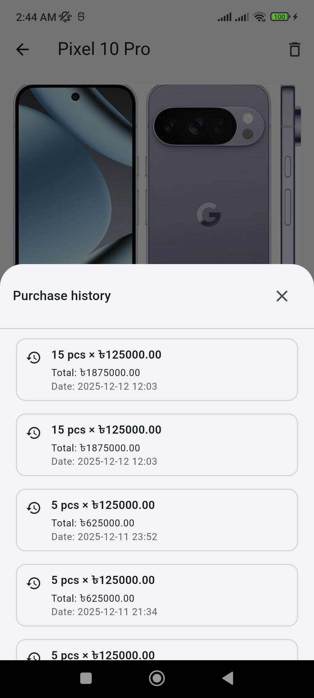
  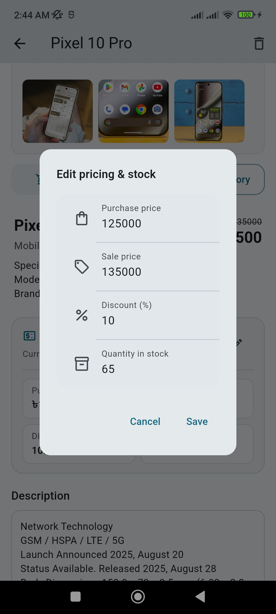
</div>

<br>

<div align="center">
  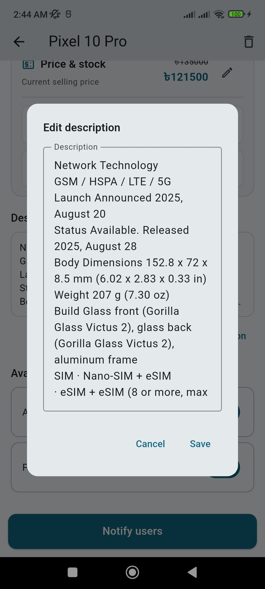
  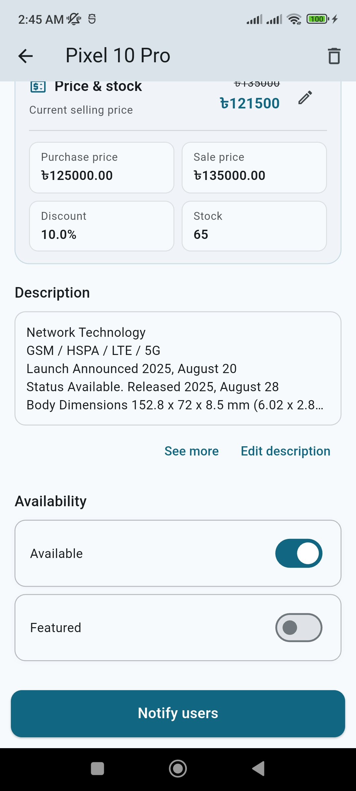
</div>

---

## Features

### Admin App (implemented)

- **Admin authentication**
  - Email/password login using Firebase Authentication (optional/planned if not enabled yet).
  - Session-aware navigation (skip login after successful sign-in).
  - Basic logout support.

- **Dashboard**
  - Clean, card-based dashboard with entry points for:
    - Categories
    - Brands
    - Products (add, list, details)
  - Designed to be extensible for future modules (orders, users, reports).

- **Category & brand management**
  - Create and list categories and brands.
  - Maintain `productCount` per category and brand and keep it updated based on stock changes.

- **Product management**
  - Add products with:
    - Name, short description, long description
    - Category and brand selection (dialog-based selection UX)
    - Purchase price, sale price, discount
    - Stock quantity and purchase date
    - Main product image (camera/gallery)
  - Product list UI includes:
    - Thumbnail, stock info, pricing block
    - Discount-aware price display (strikethrough + final price)

- **Product images**
  - Main product image upload using Firebase Storage.
  - Additional product images:
    - Stored under a Firestore subcollection + Storage folder
    - Horizontal gallery on the product details page
    - Upload/delete synchronized with Storage and Firestore
    - Hard limit on additional images per product (e.g., up to 3; configurable)

- **Pricing, stock, and discounts**
  - Dedicated **Price & stock** section on product details.
  - Edit flow for:
    - Purchase price
    - Sale price
    - Discount (%)
    - Quantity in stock
  - Final price derived from sale price and discount and shown prominently.

- **Purchase history**
  - Re-purchase dialog to:
    - Add new quantity
    - Set per-unit purchase price
    - Add optional note
  - Automatically:
    - Creates a purchase record
    - Increases stock and updates pricing
  - Purchase history bottom sheet lists:
    - Quantity, unit price, total cost, date, optional note

- **Description & info editing**
  - Short description preview under the product header.
  - Long description:
    - Truncated preview in layout
    - Full-screen dialog for editing
  - Instant UI sync using Provider + local state update where needed.

- **Availability & featured flags**
  - Availability section with:
    - `Available`
    - `Featured`
  - Updates synced with Firestore and in-memory product list.

- **User feedback and loading states**
  - `flutter_easyloading` used consistently for:
    - Loading overlays
    - Success/error/info messages
  - Helps avoid disruptive UI behavior caused by frequent SnackBars.

### User App (planned)

- Product listing with filtering by category and brand
- Product details view aligned with the shared data model
- Cart management and basic checkout
- Authentication integration to use the same Firebase backend

---

## Folder Structure

This is a simplified/combined structure. Actual files may vary based on your current implementation.

```text
ecommerce_admin_app/
├─ .dart_tool/
├─ .idea/
├─ android/   [ecommerce_admin_app_android]
├─ build/
├─ ios/
├─ lib/
│  ├─ auth/
│  │  └─ auth_service.dart
│  ├─ customwidgets/
│  │  └─ dashboard_item_view.dart
│  ├─ db/
│  │  └─ db_helper.dart
│  ├─ models/
│  │  ├─ brand.dart
│  │  ├─ brand.freezed.dart
│  │  ├─ brand.g.dart
│  │  ├─ category.dart
│  │  ├─ category.freezed.dart
│  │  ├─ category.g.dart
│  │  ├─ dashboard_model.dart
│  │  ├─ image_model.dart
│  │  ├─ image_model.freezed.dart
│  │  ├─ image_model.g.dart
│  │  ├─ product.dart
│  │  ├─ product.freezed.dart
│  │  └─ product.g.dart
│  ├─ pages/
│  │  ├─ brands/
│  │  │  └─ brand_page.dart
│  │  ├─ categories/
│  │  │  └─ category_page.dart
│  │  ├─ products/
│  │  │  ├─ add_product_page.dart
│  │  │  ├─ product_details_page.dart
│  │  │  └─ view_product_page.dart
│  │  ├─ dashboard_page.dart
│  │  └─ login_page.dart
│  ├─ providers/
│  │  ├─ brand_provider.dart
│  │  ├─ category_provider.dart
│  │  └─ product_provider.dart
│  ├─ utils/
│  │  ├─ constants.dart
│  │  ├─ price_utils.dart
│  │  ├─ timestamp_converter.dart
│  │  └─ widget_functions.dart
│  ├─ firebase_options.dart
│  └─ main.dart
├─ test/
├─ .flutter-plugins-dependencies
├─ .gitignore
├─ .metadata
├─ analysis_options.yaml
├─ ecommerce_admin_app.iml
├─ firebase.json
├─ pubspec.lock
├─ pubspec.yaml
└─ README.md
```

> Generated files from `freezed` and `json_serializable` (e.g., `*.freezed.dart`, `*.g.dart`) are created via `build_runner` and should not be edited manually.

---

## Dependencies

Check `pubspec.yaml` for exact versions.

### Firebase

- `firebase_core`
- `cloud_firestore`
- `firebase_storage`
- `firebase_auth` (optional/planned if not enabled yet)

### State management & models

- `provider`
- `freezed_annotation`
- `json_serializable`

### Routing

- `go_router` (if used)

### UI & UX

- `flutter_easyloading`

### Media & utilities

- `image_picker`

### Dev dependencies

- `build_runner`
- `freezed`
- `json_serializable`

---

## Core Logic

### Final price calculation

```dart
double calculateFinalPrice(double salePrice, double discount) {
  if (discount <= 0) return salePrice;
  final double discountAmount = salePrice * discount / 100.0;
  return salePrice - discountAmount;
}
```

In the project, this logic should live in a single place (e.g., `PriceUtils`) so it stays consistent across:

- Product list
- Product details
- Future analytics/reporting

---

## Firestore Structure

Products stored in a main collection:

- `Products/{productId}`

Additional images stored in a subcollection:

- `Products/{productId}/AdditionalImages/{imageDocId}`

Purchase history stored in a subcollection:

- `Products/{productId}/Purchases/{purchaseId}`

Categories and brands typically stored in:

- `Categories/{categoryId}`
- `Brands/{brandId}`

Category/brand analytics field:

- `productCount` maintained via delta-based update logic when stock changes

---

## Getting Started

### Prerequisites

- Flutter SDK (stable channel)
- Android Studio (or any Flutter-supported IDE)
- Firebase project with:
  - Cloud Firestore
  - Firebase Storage
  - (Optional) Firebase Authentication (Email/Password)

### Setup

Clone the repository:

```bash
git clone https://github.com/arrahman10/ecommerce_admin_app.git
cd ecommerce_admin_app
```

Install dependencies:

```bash
flutter pub get
```

Configure Firebase:

- Create a Firebase project in Firebase Console
- Add Android (and iOS if needed)
- Place `google-services.json` under `android/app/`
- Enable Firestore and Storage
- (Optional) Enable Email/Password Authentication

Generate model code (Freezed + JSON):

```bash
flutter pub run build_runner build --delete-conflicting-outputs
```

Run the app:

```bash
flutter run
```

---

## Development Notes

### Architecture

- Presentation: `pages/`
- State: `providers/` (Provider + ChangeNotifier)
- Data access: `db/db_helper.dart` (Firestore + Storage operations)
- Models: `models/` (Freezed + JSON serialization)

### State management

- Providers keep in-memory lists and update UI reactively via `Consumer` / `context.watch`.
- Local `StatefulWidget` state may be used on detail screens for instant UI updates.

### Extensibility

- Models and Firestore structure are designed to be reused by the upcoming User App.
- Easy to add future modules like order management, users, reports, low-stock alerts, and analytics.

---

## License

This project uses a custom Personal and Educational Use Only License.

Allowed:

- Reading, learning, and using the code for personal/educational purposes
- Modifying for academic work or portfolio projects

Not allowed:

- Commercial or business use without explicit permission
- Selling or sublicensing this project or substantial portions of it

For full details, see the `LICENSE` file.

---

## Author

Abdur Rahman  
Mobile App Developer (Flutter, Firebase, REST API)

- Email: arrahman.lus@gmail.com
- GitHub: https://github.com/arrahman10
- LinkedIn: https://www.linkedin.com/in/arrahman10
